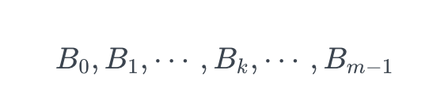
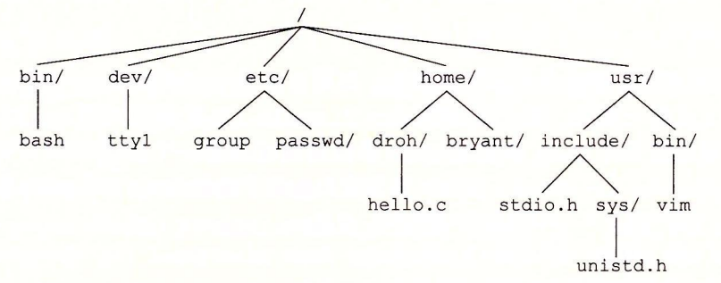

主要章节2，3，5，7，9

配套资料网站 [CSAPP](http://csapp.cs.cmu.edu/public/code.html) 获得配套代码


# 第一章 计算机系统漫游

## 1.1 编译器


gcc编译器通过这4个步骤将一个.c的文件翻译成一个可执行程序，这四个阶段就组成了编译系统

- 预处理阶段。根据#开头的一些预处理命令修改原始的c程序，将一些引入的程序插入到原来的程序中，然后会得到以.i结尾的文件
- 编译阶段。编译器将 .i 的文本文件翻译成 .s 的汇编语言程序
- 汇编阶段。将汇编语言翻译成机器语言指令，打包成一种叫可重定位目标程序
- 链接阶段。将一些标准库链接到 .o 的文件中，利用链接器进行合并，成为可执行程序

# 第十章 系统级 I/O

## 10.1 系统级I/O

一个 Linux 文件就是一个 m 个字节的序列：



所有的 I/O 设备（例如网络、磁盘和终端）都被模型化为文件，而所有的输入和输出都被当作对相应文件的读和写来执行。这种将设备优雅地映射为文件的方式，允许 Linux 内核引出一个简单、低级的应用接口，称为 Unix I/O，这使得所有的输入和输出都能以一种统一且一致的方式来执行：

- **打开文件。**一个应用程序通过要求内核打开相应的文件，来宣告它想要访问一个 I/O 设备。内核返回一个小的非负整数，叫做描述符，它在后续对此文件的所有操作中标识这个文件。内核记录有关这个打开文件的所有信息。应用程序只需记住这个描述符。

- Linux shell 创建的每个进程开始时都有三个打开的文件：**标准输入**（描述符为 0）、**标准输出**（描述符为 1）和**标准错误**（描述符为 2）。头文件 **<unistd.h>** 定义了常量 STDIN_FILENO、STDOUT_FILENO 和 STDERR_FILENO，它们可用来代替显式的描述符值。

- **改变当前的文件位置。**对于每个打开的文件，内核保持着一个文件位置 k，初始为 0。这个文件位置是从文件开头起始的字节偏移量。应用程序能够通过执行 seek 操作，显式地设置文件的当前位置为 k。

- **读写文件。**一个读操作就是从文件复制 n > 0 个字节到**内存**，从当前文件位置 k 开始，然后将 k 增加到 k+n。给定一个大小为 m 字节的文件，当k⩾m时执行读操作会触发一个称为 end-of-file（EOF）的条件，应用程序能检测到这个条件。在文件结尾处并没有明确的 “EOF 符号”。

  类似地，写操作就是从内存复制 n > 0 个字节到一个文件，从当前文件位置 k 开始，然后更新 k。

- **关闭文件。**当应用完成了对文件的访问之后，它就通知内核关闭这个文件。作为响应，内核释放文件打开时创建的数据结构，并将这个描述符恢复到可用的描述符池中。无论一个进程因为何种原因终止时，内核都会关闭所有打开的文件并释放它们的内存资源。

## 10.2 文件

每个 Linux 文件都有一个**类型**（type）来表明它在系统中的角色：

- **普通文件**（regular file）包含任意数据。应用程序常常要区分**文本文件**（text file）和**二进制文件**（binary file），文本文件是只含有 ASCII 或 Unicode 字符的普通文件；二进制文件是所有其他的文件。对内核而言，文本文件和二进制文件没有区别。

  Linux 文本文件包含了一个**文本行**（text line）序列，其中每一行都是一个字符序列，以一个新行符（“\n”）结束。新行符与 ASCII 的换行符（LF）是一样的，其数字值为 0x0a。

- **目录**（directory）是包含一组**链接**（link）的文件，其中每个链接都将一个**文件名**（filename）映射到一个文件，这个文件可能是另一个目录。每个目录至少含有两个条目：是到该目录自身的链接，以及是到目录层次结构（见下文）中**父目录**（parent directory）的链接。你可以用 mkdir 命令创建一个目录，用 Is 查看其内容，用 rmdir 删除该目录。

- **套接字**（socket）是用来与另一个进程进行跨网络通信的文件（11.4 节）。

Linux 内核将所有文件都组织成一个**目录层次结构**（directory hierarchy），由名为 /（斜杠）的**根目录**确定。系统中的每个文件都是根目录的直接或间接的后代。图 10-1 显示了 Linux 系统的目录层次结构的一部分。



作为其上下文的一部分，每个进程都有一个**当前工作目录**（current working directory）来确定其在目录层次结构中的当前位置。你可以用 cd 命令来修改 shell 中的当前工作目录。

目录层次结构中的位置用**路径名**（pathname）来指定。路径名是一个字符串，包括一个可选斜杠，其后紧跟一系列的文件名，文件名之间用斜杠分隔。路径名有两种形式：

- **绝对路径名**（absolute pathname）以一个斜杠开始，表示从根节点开始的路径。例如，在图 中，hello.c 的绝对路径名为 **/home/droh/hello.c**。
- **相对路径名**（relative pathname）以文件名开始，表示从当前工作目录开始的路径。例如，在图中，如果 **/home/droh** 是当前工作目录，那么 **hello.c** 的相对路径名就是 **./hello.c**。反之，如果 **/home/bryant** 是当前工作目录，那么相对路径名就是 **../home/droh/hello.c**。

## 10.3 打开和关闭文件

进程是通过调用 open 函数来打开一个已存在的文件或者创建一个新文件的：

```c
#include <sys/types.h>
#include <sys/stat.h>
#include <fcntl.h>

int open(char *filename, int flags, mode_t mode);

// 返回：若成功则为新文件描述符，若出错为 -1。
```

open 函数将 filename 转换为一个文件描述符，并且返回描述符数字。返回的描述符总是在进程中当前没有打开的最小描述符。flags 参数指明了进程打算如何访问这个文件：

- O_RDONLY：只读。
- O_WRONLY：只写。
- O_RDWR：可读可写。

例如，下面的代码说明如何以读的方式打开一个已存在的文件：

`fd = Open("foo.txt", O_RDONLY, 0);`

flags 参数也可以是一个或者更多位掩码的或，为写提供给一些额外的指示：

- O_CREAT：如果文件不存在，就创建它的一个**截断的**（truncated）（空）文件。
- O_TRUNC：如果文件已经存在，就截断它。
- O_APPEND：在每次写操作前，设置文件位置到文件的结尾处。

例如，下面的代码说明的是如何打开一个已存在文件，并在后面添加一些数据：

`fd = Open("foo.txt", O_WRONLY|O_APPEND, 0);`

最后，进程通过调用 close 函数关闭一个打开的文件。

```c
#include <unistd.h>

int close(int fd);

// 返回：若成功则为 0，若出错则为 -1
```

## 10.4 读写文件

应用程序是通过分别调用 read 和 write 函数来执行输入和输出的。

```c
#include <unistd.h>

ssize_t read(int fd, void *buf, size_t n);
// 返回：若成功则为读的字节数，若 EOF 则为0，若出错为 -1。

ssize_t write(int fd, const void *buf, size_t n);
// 返回：若成功则为写的字节数，若出错则为 -1。
```

read 函数从描述符为 fd 的当前文件位置复制最多 n 个字节到内存位置 buf。返回值 -1 表示一个错误，而返回值 0 表示 EOF。否则，返回值表示的是实际传送的字节数量。

write 函数从内存位置 buf 复制至多 n 个字节到描述符 fd 的当前文件位置。图 10-3 展示了一个程序使用 read 和 write 调用**一次一个**字节地从标准输入复制到标准输出。

在某些情况下，read 和 write 传送的字节比应用程序要求的要少。这些**不足值**（short count）不表示有错误。出现这样情况的原因有：

- **读时遇到 EOF。**假设我们准备读一个文件，该文件从当前文件位置开始只含有 20 多个字节，而我们以 50 个字节的片进行读取。这样一来，下一个 read 返回的不足值为 20，此后的 read 将通过返回不足值 0 来发出 EOF 信号。
- **从终端读文本行。**如果打开文件是与终端相关联的（如键盘和显示器），那么每个 read 函数将一次传送一个文本行，返回的不足值等于文本行的大小。
- **读和写网络套接字**（socket）。如果打开的文件对应于网络套接字（11.4 节），那么内部缓冲约束和较长的网络延迟会引起 read 和 write 返回不足值。对 Linux 管道（pipe）调用 read 和 write 时，也有可能出现不足值，这种进程间通信机制不在我们讨论的范围之内。

实际上，除了 EOF，当你在读磁盘文件时，将不会遇到不足值，而且在写磁盘文件时，也不会遇到不足值。然而，如果你想创建健壮的（可靠的）诸如 Web 服务器这样的网络应用，就必须通过反复调用 read 和 write 处理不足值，直到所有需要的字节都传送完毕。

## 10.5 用RIO包健壮地读写

在这一小节里，我们会讲述一个 I/O 包，称为 RIO（Robust I/O，健壮的 I/O）包，它会自动为你处理上文中所述的不足值。在像网络程序这样容易出现不足值的应用中，RIO 包提供了方便、健壮和高效的 I/O。RIO 提供了两类不同的函数：

- **无缓冲的输入输出函数。**这些函数直接在内存和文件之间传送数据，没有应用级缓冲。它们对将二进制数据读写到网络和从网络读写二进制数据尤其有用。
- **带缓冲的输入函数。**这些函数允许你高效地从文件中读取文本行和二进制数据，这些文件的内容缓存在应用级缓冲区内，类似于为 printf 这样的标准 I/O 函数提供的缓冲区。与【110】中讲述的带缓冲的 I/O 例程不同，带缓冲的 RIO 输入函数是线程安全的（12.7.1 节），它在同一个描述符上可以被交错地调用。例如，你可以从一个描述符中读一些文本行，然后读取一些二进制数据，接着再多读取一些文本行。

### 10.5.1 RIO的无缓冲的输入输出函数

通过调用 rio_readn 和 rio_writen 函数，应用程序可以在内存和文件之间直接传送数据。

```c
#include "csapp.h"

ssize_t rio_readn(int fd, void *usrbuf, size_t n);
ssize_t rio_writen(int fd, void *usrbuf, size_t n);
// 返回：若成功则为传送的字节数，若 EOF 则为 0(只对 rio_readn 而言)，若出错则为 -1。
```

rio_readn 函数从描述符 fd 的当前文件位置最多传送 n 个字节到内存位置 usrbuf。类似地，rio_writen 函数从位置 usrbuf 传送 n 个字节到描述符 fd。rio_read 函数在遇到 EOF 时只能返回一个不足值。rio_writen 函数决不会返回不足值。对同一个描述符，可以任意交错地调用 rio_readn 和 rio_writen。

注意，如果 rio_readn 和 rio_writen 函数被一个从应用信号处理程序的返回中断，那么每个函数都会手遍地重启 read 或 write。为了尽可能有较好的可移植性，我们允许被中断的系统调用，且在必要时重启它们。

```c
ssize_t rio_readn(int fd, void *usrbuf, size_t n)
{
    size_t nleft = n;
    ssize_t nread;
    char *bufp = usrbuf;

    while (nleft > 0) {
        if ((nread = read(fd, bufp, nleft)) < 0) {
            if (errno == EINTR) /* Interrupted by sig handler return */
                nread = 0;      /* and call read() again */
            else
                return -1;      /* errno set by read() */
        }
        else if (nread == 0)
            break;              /* EOF */
        nleft -= nread;
        bufp += nread;
    }
    return (n - nleft);         /* Return >= 0 */
}
```

```c
ssize_t rio_writen(int fd, void *usrbuf, size_t n)
{
    size_t nleft = n;
    ssize_t nwritten;
    char *bufp = usrbuf;

    while (nleft > 0) {
        if ((nwritten = write(fd, bufp, nleft)) <= 0) {
            if (errno == EINTR)  /* Interrupted by sig handler return */
                nwritten = 0;    /* and call write() again */
            else
                return -1;       /* errno set by write() */
        }
        nleft -= nwritten;
        bufp += nwritten;
    }
    return n;
}
```

### 10.5.2 RIO的带缓冲区的输入函数

假设我们要编写一个程序来计算文本文件中文本行的数量，该如何来实现呢？一种方法就是用 read 函数来一次一个字节地从文件传送到用户内存，检查每个字节来查找换行符。这个方法的缺点是效率不是很高，每读取文件中的一个字节都要求陷入内核。

一种更好的方法是调用一个包装函数（rio_readlineb），它从一个内部**读缓冲区**复制一个文本行，当缓冲区变空时，会自动地调用 read 重新填满缓冲区。对于既包含文本行也包含二进制数据的文件（例如 11.5.3 节中描述的 HTTP 响应），我们也提供了一个 rio_readn 带缓冲区的版本，叫做 rio_readnb，它从和 rio_readlineb 一样的读缓冲区中传送原始字节。

```c
#include "csapp.h"

void rio_readinitb(rio_t *rp, int fd);
// 返回：无。

ssize_t rio_readlineb(rio_t *rp, void *usrbuf, size_t maxlen);
ssize_t rio_readnb(rio_t *rp, void *usrbuf, size_t n);
// 返回：若成功则为读的字节数，若 EOF 则为 0，若出错则为 -1。 
```

每打开一个描述符，都会调用一次 rio_readinitb 函数。它将描述符 fd 和地址 rp 处的一个类型为 rio_t 的读缓冲区联系起来。

rio_readlineb 函数从文件叩读出下一个文本行（包括结尾的换行符），将它复制到内存位置 usrbuf，并且用 NULL（零）字符来结束这个文本行。rio_readlineb 函数最多读 **maxlen-1** 个字节，余下的一个字符留给结尾的 NULL 字符。超过 **maxlen-1** 字节的文本行被截断，并用一个 NULL 字符结束。

rio_readnb 函数从文件 rp 最多读 n 个字节到内存位置 usrbuf。对同一描述符，对 rio_readlineb 和 rio_readnb 的调用可以任意交叉进行。然而，对这些带缓冲的函数的调用却不应和无缓冲的 rio_readn 函数交叉使用。


**具体实现代码可以看demo-code rio.cpp的实现**

