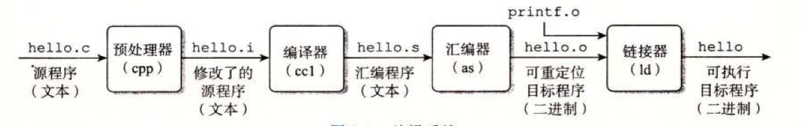

主要章节2，3，5，7，9

# 第一章 计算机系统漫游

## 1.1 编译器

gcc编译器通过这4个步骤将一个.c的文件翻译成一个可执行程序，这四个阶段就组成了编译系统

- 预处理阶段。根据#开头的一些预处理命令修改原始的c程序，将一些引入的程序插入到原来的程序中，然后会得到以.i结尾的文件
- 编译阶段。编译器将 .i 的文本文件翻译成 .s 的汇编语言程序
- 汇编阶段。将汇编语言翻译成机器语言指令，打包成一种叫可重定位目标程序
- 链接阶段。将一些标准库链接到 .o 的文件中，利用链接器进行合并，成为可执行程序

